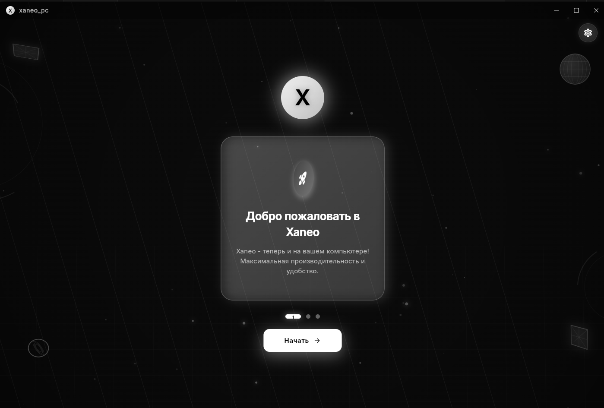
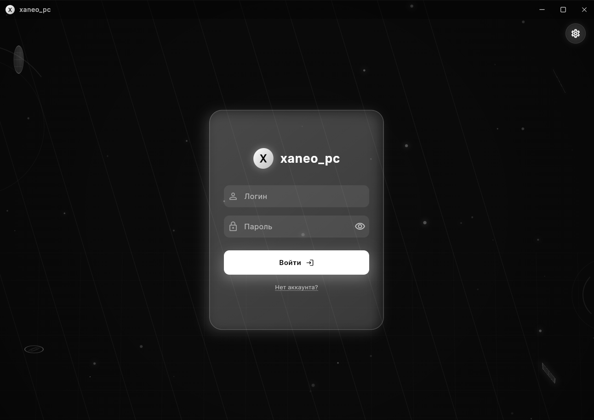
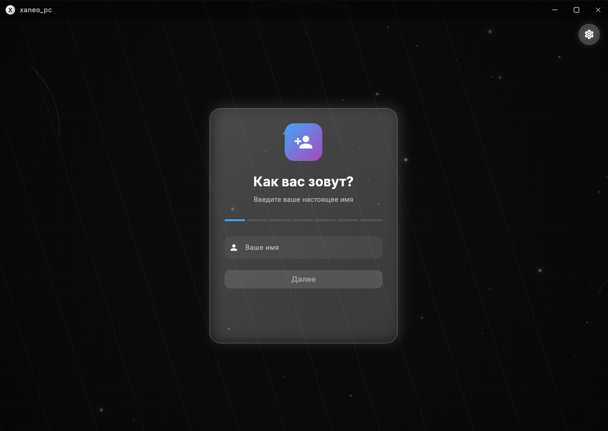
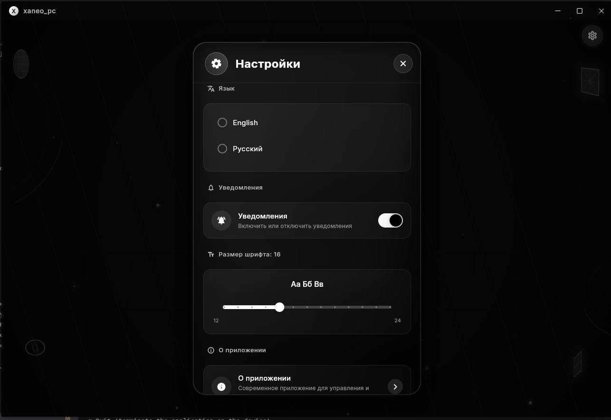
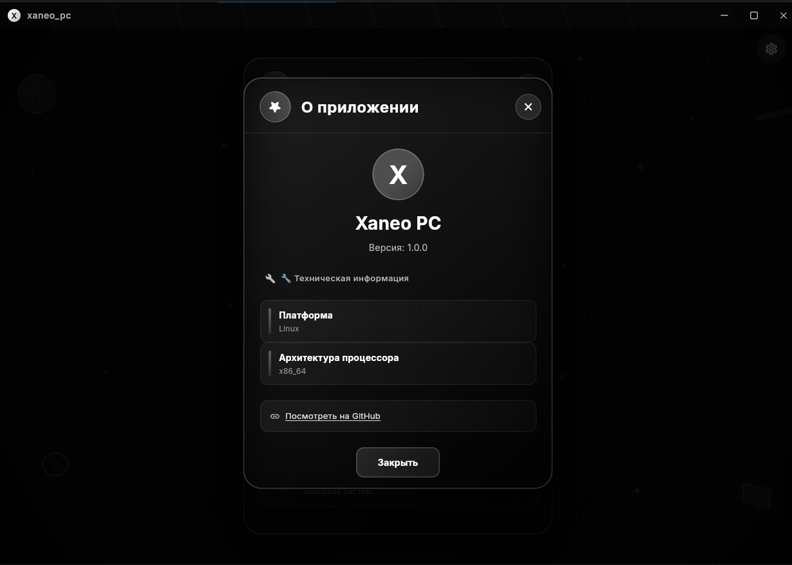

# Xaneo PC


Десктопное приложение на Flutter для Windows/Linux/macOS с стильным чёрно-белым онбордингом и 3D эффектами.

**Примечание:** Это не весь проект Xaneo. Мы вернёмся к полному проекту позже. Эта версия — desktop-клиент для компьютеров.

## Скриншоты

### Онбординг

*Стильный чёрно-белый онбординг с 3D эффектами и плавными анимациями*

### Экран входа

*Минималистичный экран входа с эффектом стекла и анимированными полями ввода*

### Экран регистрации

*Расширенная форма регистрации с валидацией и интерактивными элементами*

### Настройки

*Модальное окно настроек с выбором языка, размера шрифта и темы*

### О приложении

*Информационное окно с техническими деталями и ссылками*

## Особенности

- 🎨 **Чёрно-белая тема** - минималистичный и стильный дизайн
- 🚀 **3D эффекты** - интерактивные карточки с параллаксом
- ✨ **Анимации** - плавные переходы и эффекты появления
- 🌐 **Локализация** - поддержка русского и английского языков
- 💫 **Частицы** - анимированный фон с частицами
- 📱 **Кроссплатформенность** - Windows, Linux, macOS

## Загрузки

⚠️ **Важное предупреждение:** Представленные ниже пакеты очень старые и не содержат последних изменений. Рекомендуется собирать приложение из исходного кода для получения актуальной версии.

### Linux

### Linux

- **DEB** (Debian/Ubuntu): [xaneo-pc_1.0.0_amd64.deb](dist/xaneo-pc_1.0.0_amd64.deb)  
  Установка: `sudo dpkg -i xaneo-pc_1.0.0_amd64.deb`
- **RPM** (Fedora/openSUSE): [xaneo_pc-1.0.0-1.x86_64.rpm](dist/xaneo_pc-1.0.0-1.x86_64.rpm)  
  Установка: `sudo rpm -i xaneo_pc-1.0.0-1.x86_64.rpm`
- **Pacman** (Arch/CachyOS): [xaneo_pc-1.0.0-1-x86_64.pkg.tar.zst](dist/xaneo_pc-1.0.0-1-x86_64.pkg.tar.zst)  
  Установка: `sudo pacman -U xaneo_pc-1.0.0-1-x86_64.pkg.tar.zst`
- **APK** (Alpine): [xaneo_pc-1.0.0-x86_64.apk](dist/xaneo_pc-1.0.0-x86_64.apk)  
  Установка: `apk add --allow-untrusted xaneo_pc-1.0.0-x86_64.apk`
- **Tar.gz** (Slackware): [xaneo_pc-1.0.0-x86_64.tgz](dist/xaneo_pc-1.0.0-x86_64.tgz)  
  Установка: `tar -xzf xaneo_pc-1.0.0-x86_64.tgz -C /`
- **AppImage** (универсальный): [xaneo_pc.AppImage](dist/xaneo_pc.AppImage)  
  Запуск: `chmod +x xaneo_pc.AppImage && ./xaneo_pc.AppImage`
- **Nix** (NixOS): [xaneo_pc.nix](dist/xaneo_pc.nix) + [bundle/](dist/bundle/)  
  Установка: `nix-env -i -f xaneo_pc.nix`

### Windows

Собирается на Windows: `flutter build windows --release`

### macOS

Собирается на macOS: `flutter build macos --release`

## Особенности

- 🎨 **Чёрно-белая тема** - минималистичный и стильный дизайн
- 🚀 **3D эффекты** - интерактивные карточки с параллаксом
- ✨ **Анимации** - плавные переходы и эффекты появления
- 🌐 **Локализация** - поддержка русского и английского языков
- 💫 **Частицы** - анимированный фон с частицами
- 📱 **Кроссплатформенность** - Windows, Linux, macOS

## Технологии

- **Flutter** - фреймворк для кроссплатформенной разработки
- **Dart** - язык программирования
- **Provider** - управление состоянием
- **url_launcher** - открытие внешних ссылок

## Структура проекта

```
lib/
├── l10n/                    # Локализация
│   ├── app_localizations.dart
│   ├── app_localizations_en.dart
│   ├── app_localizations_ru.dart
│   ├── app_en.arb
│   └── app_ru.arb
├── models/                  # Модели данных
├── providers/               # State management
│   ├── theme_provider.dart
│   └── locale_provider.dart
├── screens/                 # Экраны приложения
│   ├── onboarding_screen.dart
│   └── login_screen.dart
├── styles/                  # Стили приложения
│   └── app_styles.dart
├── utils/                   # Утилиты
├── widgets/                 # Переиспользуемые виджеты
│   ├── 3d_card.dart
│   └── particle_background.dart
└── main.dart                # Точка входа
```

## Установка зависимостей

```bash
flutter pub get
```

## Запуск приложения

### Windows
```bash
flutter run -d windows
```

### Linux
```bash
flutter run -d linux
```

### macOS
```bash
flutter run -d macos
```

## Сборка приложения

### Windows
```bash
flutter build windows --release
```

### Linux
```bash
flutter build linux --release
```

### macOS
```bash
flutter build macos --release
```

## Онбординг

Приложение содержит три этапа онбординга:

1. **Приветствие** - "Добро пожаловать в Xaneo"
2. **Приватность** - "Все ваши данные в безопасности"
3. **Хранение данных** - "Все дата-центры Xaneo находятся в России"

После завершения онбординга пользователь переходит на экран входа.

## Технологии

- **Flutter** - кроссплатформенный фреймворк
- **Provider** - управление состоянием
- **shared_preferences** - хранение настроек
- **flutter_localizations** - локализация

## Лицензия

MIT License
